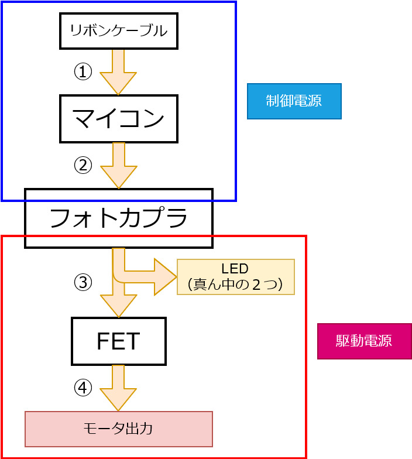

2020/03/11 根本
# モータドライバ 概要

この図はモータドライバの中で制御信号がモータへの出力になるまでの経過を表しています．図中のリボンケーブルからモータ出力の間のどこかが切れてしまうだけでモータは動かなくなってしまいます．

* ①：制御信号（モータの正転/逆転，PWM信号） 
* マイコン：①を②に変換
* ②：Hブリッジ回路のFETに出力する信号
* フォトカプラ：②を③に変換
* ③：②(0～5V)を(0～12V)に変換した信号
* FET：③の電流を増幅
* ④：モータ出力

 

# 修理する際に気を付けること
* ***導通チェックをする際は制御，駆動電源共に必ず電源を消して***行ってください．
* スピコンを用いて ②③④ の電圧をチェックすることで故障個所を発見する作業を行います．この際は，***電源は安定化電源を用い，絶対にリポバッテリを使わないでください．***
* 測定者（ 1 人目）とスピコンの操作と電源を管理する人（ 2 人目）の 2 人でやることが安全で楽です．
* ***駆動電源はすぐに切れるようにしてください．（煙，異臭，異音がしたときは周りに確認せずにすぐに消してください）***

電圧が正常かどうかは正常に動いているモータドライバと比べてください（ついでにモータドライバの仕組みがわかるはずです）

ちなみに，正常に動いていたモータドライバが動かなくなる時はフォトカプラか FET が壊れていることが多いです．逆に新しく作ったモータドライバが動かないときは GND との導通が多く，その導通によってフォトカプラや FET が壊れることもあります．前者の対策を ○，後者の対策を ● で示しますが．何も書かれていなければ前者は部品交換を，後者は導通チェックをしてください．

# 反応からの故障個所の発見
1. ***駆動電源の LED がつかない（モータは動かしていないとき）*** 
    〇 LED が壊れているかもしれません．LED に適切な電圧がかかっていることを確認して上で LED を交換してください． 
    ● 駆動電源か LED のマイナス側がどこかでショートしています．地道に導通チェックをしてください．
2. ***特定の動作（正転 or 逆転）のときに駆動電源の LED が消える．*** 
    ② からそれ以降に故障の可能性があります．フォトカプラと FET がそれぞれ 1 つずつの組が，H ブリッジ回路のそれぞれのスイッチ部分を表しています．どこのスイッチがつながったときにショートするかを考えて，故障個所を絞ってください．（例えば H ブリッジ回路の左上と左下のスイッチが押されたときはショートですよね？）また「3.」の項目も読んでください．
3. ***PWM の制御が効かない（ 0% か 100% でしか動かない）***  
    「2.」と同時に起こることが多いです．② からそれ以降に故障の可能性があります．
4. ***4 つの LED はすべて点灯している（ PWM に応じた明るさの変化も正常）が，モータが動かない．*** 
    ② からそれ以降に故障がある可能性があります．ただし，PWM によって LED の明るさが変化するので，LED のつながる 2 つのフォトカプラまでは正常です．そこから先と，その他の 2 つの ② からそれ以降をチェックしてください．

# 各箇所ごとの故障時の反応と故障個所の発見
1. ***① が GND ショートしたとき*** 
    モータが動きませんが，モータドライバ自体への負荷は比較的軽微です．（一度動いていたモータドライバではほとんど起きません）① の導通を探しましょう．
2. ***マイコンが壊れた，② が GND とショートした*** 
    モータが正転 or 逆転のみする，動かない，駆動電源がショートする 
    の 3 パターンが起こりえます．4 つのフォトカプラにつながっている ② の導通を探しましょう．また導通していない場合は，制御電源のみをつけて ② の電圧を測定しましょう．ちなみにオシロスコープでも可です．
3. ***フォトカプラが壊れた，③ がショートした*** 
    ここから駆動電源になります．電圧を測る際は駆動電源側の GND と比べてください．起こる故障は「2.」と同様で，さらに LED が付かないという状態になります．故障しているところの発見方法は「2.」と同じですが駆動電源もつけて動作チェックを行います．すぐに電源を消せるようにしてください．
4. ***FET が壊れた，④ がショートした*** 
    ここの故障が起こった際に煙，火花が出ることが多いです．FET の足同士の導通チェックをするとだいたい導通します，つまり FET が壊れていることが多いです． 
    ● この FET を壊す要因がマイコン～ ④ までの間にあることが多いので気を FET の交換だけで済むことはないと思ってください． 
    故障しているところの発見方法は「3.」と同じです．

# 最後に
これを読まなくても，正常なモータドライバと比べれば故障個所はわかると思います．また，モータドライバ自体は難しいように見えて，ただの電気信号で制御するスイッチと同じです．（フォトカプラはマイコンからの信号を伝達しているだけ，FET は信号に応じてスイッチングしているだけです）H ブリッジ回路も難しいものではありません．この修理の際に一番大事なのは，安全に行うことです．それを一番意識して修理を行ってください．

